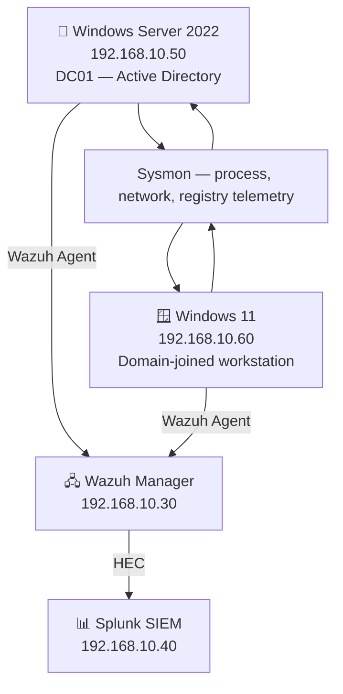
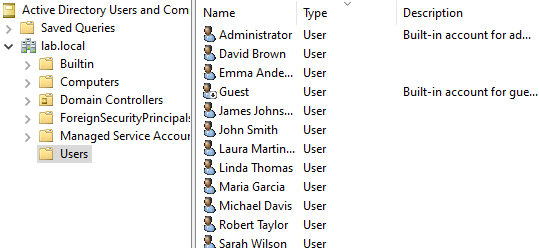
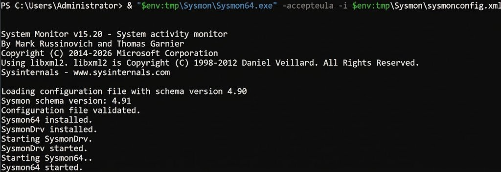
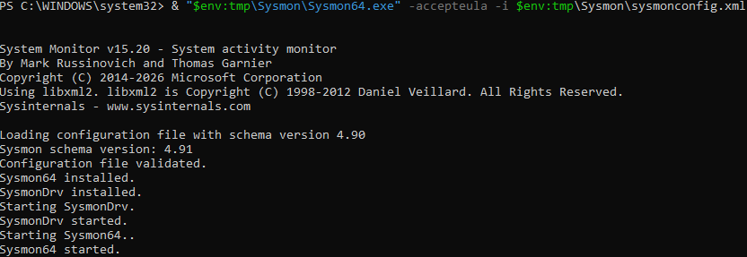
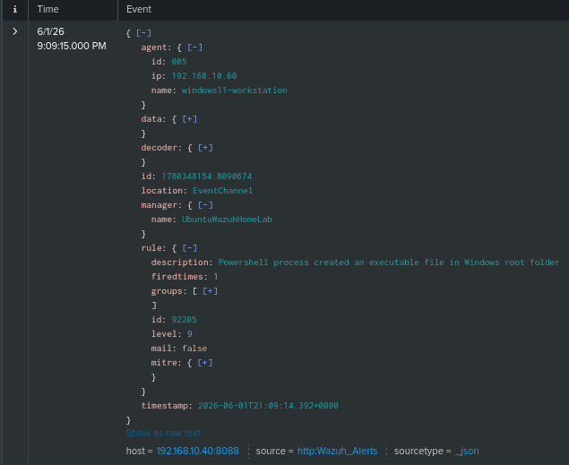

# Phase 5 — Active Directory + Sysmon Deployment

## Overview

This phase extends the lab with a Windows-based corporate environment by deploying Active Directory Domain Services on Windows Server 2022 and enhancing Windows telemetry through Sysmon. Windows Server acts as the Domain Controller for the `lab.local` domain, while Windows 11 is joined as a domain workstation. Sysmon is deployed on both endpoints using Olaf Hartong's modular configuration — the industry-standard ruleset mapped to MITRE ATT&CK. The combined telemetry from Sysmon and the Wazuh Agent provides high-fidelity visibility into process execution, network connections, and Windows event activity.

---

## Environment

| Component | Version | Host |
|-----------|---------|------|
| Active Directory Domain Services | Windows Server 2022 | 192.168.10.50 |
| Domain | `lab.local` (NetBIOS: `LAB`) | — |
| Wazuh Agent | 4.14.5 | Windows Server 2022 — 192.168.10.50 |
| Wazuh Agent | 4.14.5 | Windows 11 — 192.168.10.60 |
| Sysmon | Latest (Sysinternals) | Windows Server 2022 + Windows 11 |
| Sysmon configuration | sysmon-modular (Olaf Hartong) | — |

---

## Architecture



---

## Deployment

### Active Directory Domain Controller

Windows Server 2022 was renamed to `DC01` and promoted to a Domain Controller, creating the `lab.local` forest:

```powershell
Rename-Computer -NewName "DC01" -Restart
Install-WindowsFeature -Name AD-Domain-Services -IncludeManagementTools
Install-ADDSForest -DomainName "lab.local" -DomainNetbiosName "LAB" -InstallDns -Force
```

A static IP was configured on the internal network adapter, with the DNS pointing to itself:

```powershell
New-NetIPAddress -InterfaceAlias "Ethernet" -IPAddress 192.168.10.50 -PrefixLength 24
Set-DnsClientServerAddress -InterfaceAlias "Ethernet" -ServerAddresses 192.168.10.50
```

### Domain Users

Ten departmental users were created via PowerShell to simulate a realistic corporate environment, providing identities for the attack simulations in Phase 7:

```powershell
$users = @(
    @{Name="John Smith"; Sam="jsmith"; Pass="Password123!"; Dept="IT"},
    @{Name="Maria Garcia"; Sam="mgarcia"; Pass="Welcome2024!"; Dept="HR"},
    @{Name="David Brown"; Sam="dbrown"; Pass="Spring2024!"; Dept="Finance"},
    @{Name="Sarah Wilson"; Sam="swilson"; Pass="Summer123!"; Dept="Marketing"},
    @{Name="Michael Davis"; Sam="mdavis"; Pass="Winter456!"; Dept="IT"},
    @{Name="Laura Martinez"; Sam="lmartinez"; Pass="Autumn789!"; Dept="Sales"},
    @{Name="James Johnson"; Sam="jjohnson"; Pass="Welcome1!"; Dept="IT"},
    @{Name="Emma Anderson"; Sam="eanderson"; Pass="Qwerty2024!"; Dept="HR"},
    @{Name="Robert Taylor"; Sam="rtaylor"; Pass="Admin2024!"; Dept="Finance"},
    @{Name="Linda Thomas"; Sam="lthomas"; Pass="Letmein123!"; Dept="Sales"}
)

foreach ($user in $users) {
    New-ADUser -Name $user.Name -SamAccountName $user.Sam `
        -UserPrincipalName "$($user.Sam)@lab.local" `
        -AccountPassword (ConvertTo-SecureString $user.Pass -AsPlainText -Force) `
        -Department $user.Dept -Enabled $true
}
```

> **Note:** Passwords are intentionally weak to enable credential-based attack scenarios in Phase 7.

### Windows 11 Domain Join

Windows 11 was joined to the `lab.local` domain after configuring the DNS to resolve through the Domain Controller:

```powershell
Set-DnsClientServerAddress -InterfaceAlias "Ethernet 2" -ServerAddresses 192.168.10.50
Add-Computer -DomainName "lab.local" -Credential "LAB\Administrator" -Restart
```

### Wazuh Agents on Windows

Both Windows endpoints were enrolled through the Wazuh Dashboard's **Deploy new agent** wizard:

| Endpoint | Agent name |
|----------|------------|
| Windows Server 2022 | `dc01-windows-server` |
| Windows 11 | `windows11-workstation` |

Installation command generated by the wizard:

```powershell
Invoke-WebRequest -Uri https://packages.wazuh.com/4.x/windows/wazuh-agent-4.14.5-1.msi -OutFile $env:tmp\wazuh-agent
msiexec.exe /i $env:tmp\wazuh-agent /q WAZUH_MANAGER='192.168.10.30' WAZUH_AGENT_NAME='<agent-name>'
NET START WazuhSvc
```

### Sysmon Deployment

Sysmon was installed on both Windows endpoints using Olaf Hartong's `sysmon-modular` configuration — the de facto industry standard, with MITRE ATT&CK technique mappings built in:

```powershell
Invoke-WebRequest -Uri https://download.sysinternals.com/files/Sysmon.zip -OutFile $env:tmp\Sysmon.zip
Expand-Archive -Path $env:tmp\Sysmon.zip -DestinationPath $env:tmp\Sysmon
Invoke-WebRequest -Uri https://raw.githubusercontent.com/olafhartong/sysmon-modular/master/sysmonconfig.xml -OutFile $env:tmp\Sysmon\sysmonconfig.xml
& "$env:tmp\Sysmon\Sysmon64.exe" -accepteula -i $env:tmp\Sysmon\sysmonconfig.xml
```

### Wazuh Integration with Sysmon

The Wazuh shared agent configuration was updated to forward the Sysmon Operational channel from all Windows agents:

```bash
sudo nano /var/ossec/etc/shared/default/agent.conf
```

```xml
<agent_config os="Windows">
  <localfile>
    <location>Microsoft-Windows-Sysmon/Operational</location>
    <log_format>eventchannel</log_format>
  </localfile>
</agent_config>
```

The Wazuh Manager was restarted and the configuration automatically propagated to all enrolled Windows agents.

---

## Validation

Both Windows agents are reporting Sysmon events to Splunk via Wazuh. The following Sysmon-enriched alerts were observed within minutes of deployment:

| Rule ID | Level | Description | Source |
|---------|-------|-------------|--------|
| 92205 | 9 | Powershell process created an executable file in Windows root folder | windows11-workstation |
| 61138 | 5 | New Windows Service Created | dc01-windows-server |
| 60106 | 3 | Windows Logon Success | windows11-workstation |

**SPL query to confirm Sysmon ingestion in Splunk:**

```
index="wazuh" data.win.system.providerName="Microsoft-Windows-Sysmon"
```

Sysmon rule 92205 (PowerShell creating an executable in `C:\`) is particularly valuable — it detects a common malware staging technique and is mapped to MITRE ATT&CK techniques T1059.001 (PowerShell) and T1105 (Ingress Tool Transfer).

---

## Troubleshooting & Lessons Learned

### Wazuh Custom Integration Failing with "Connection refused"

After redeploying the Wazuh Manager, the custom Python integration script for Splunk HEC began failing with `urlopen error [Errno 111] Connection refused`, despite the HEC endpoint being fully accessible from the same VM via `curl`. The embedded Python interpreter shipped with Wazuh had network-stack issues unrelated to the actual HEC connectivity.

**Solution:** Replaced the Python-based integration wrapper with a shell wrapper that invokes `curl` directly, bypassing the embedded Python entirely:

```bash
#!/bin/sh
ALERT_FILE="$1"
API_KEY="$2"
HOOK_URL="$3"

ALERT_DATA=$(cat "$ALERT_FILE")
PAYLOAD="{\"event\": $ALERT_DATA}"

curl -s -X POST "$HOOK_URL" \
  -H "Authorization: Splunk $API_KEY" \
  -H "Content-Type: application/json" \
  -d "$PAYLOAD" >> /var/ossec/logs/integrations.log 2>&1
```

This restored the full Wazuh → Splunk pipeline using only system-level networking.

### Windows 11 Failing to Join the Domain


---

## Result

- `DC01` running Active Directory Domain Services for the `lab.local` domain
- 10 departmental domain users created
- Windows 11 successfully joined to the domain — domain users can authenticate
- Wazuh Agents active on both Windows endpoints
- Sysmon deployed with Olaf Hartong's MITRE-mapped configuration on both endpoints
- Sysmon events flowing end-to-end: Windows endpoint → Sysmon → Wazuh Agent → Wazuh Manager → Splunk HEC → Splunk SIEM

---

## Screenshots

| Screenshot | Description |
|------------|-------------|
|  | Active Directory users in `lab.local` |
|  | Sysmon service running on Windows Server |
|  | Sysmon service running on Windows 11 |
|  | Sysmon rule 92205 — PowerShell executable creation detection |

---

*Previous: [Phase 4 — Suricata IDS](phase4-suricata.md)*
*Next: [Phase 6 — Detection Rules](phase6-detection-rules.md)*
