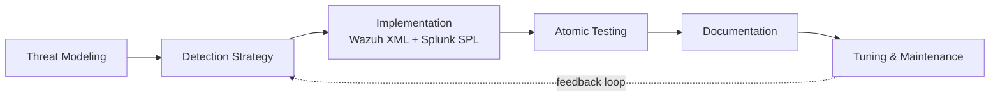

# Phase 6 — Detection Rules

## Overview

This phase covers the design, implementation, and validation of 15+ custom detection rules across the SOC HomeLab. Each rule is developed using a formal Detection Engineering methodology — combining threat intelligence, MITRE ATT&CK mapping, and atomic testing — rather than ad-hoc rule writing. The goal is to demonstrate not only the ability to write rules but to **engineer detections** as a discipline.

---

## Detection Engineering Methodology

Every rule in this phase follows the same lifecycle:

### 1. Threat Modeling
Each rule begins by identifying the threat it addresses — which adversaries use the technique, which malware implements it, and what real-world impact it has. References to MITRE ATT&CK, threat intelligence reports, and known incidents are documented.

### 2. Detection Strategy
Before writing code, the detection logic is defined conceptually:
- Which data source provides visibility (Wazuh, Sysmon, Suricata, AD logs)
- Which fields are relevant
- What threshold or pattern indicates the threat
- What false positives must be considered

### 3. Implementation
Each rule is implemented in two systems:
- **Wazuh** — XML rule for native EDR-level detection
- **Splunk** — SPL query for SIEM-level correlation and enrichment

This dual approach reflects real-world SOC operations, where the same logic is often expressed across multiple platforms.

### 4. Atomic Testing
Each rule is validated by executing a controlled attack from the Kali Linux machine — an **atomic test** — and verifying that the rule fires correctly. Where applicable, tests follow the [Atomic Red Team](https://atomicredteam.io/) framework.

### 5. Documentation
Each rule is documented using a standardized template covering metadata, logic, code, validation steps, and known limitations. Documentation lives in `detection-engineering/rules/`.

### 6. Tuning & Maintenance
False positives identified during validation are mitigated through whitelisting, threshold adjustments, or rule refinement.

---

## Design Principles

### Pyramid of Pain — Detection Robustness

Rules in this phase aim to detect adversary behavior at the **highest levels** of the Pyramid of Pain (David Bianco), prioritizing TTPs and tools over fragile indicators like hashes or IPs. This ensures detections remain effective even when attackers modify their infrastructure.

### Detection-as-Code

All rules are versioned in Git, documented with structured metadata, and treated as production code. This reflects modern Detection-as-Code practices used by mature SOC teams.

### MITRE ATT&CK Coverage

Each rule is mapped to one or more MITRE ATT&CK techniques. The goal is to achieve detection coverage across multiple tactics — not just one phase of an attack.

---

## Rule Catalog

| # | Rule Name | MITRE Technique | Tactic | Severity | Data Source |
|---|-----------|-----------------|--------|----------|-------------|
| 1 | SSH Brute Force | T1110.001 | Credential Access | High | Wazuh / Suricata |
| 2 | Password Spraying | T1110.003 | Credential Access | High | Wazuh / AD |
| 3 | RDP Brute Force | T1110.001 | Credential Access | High | Wazuh / Sysmon |
| 4 | PowerShell Encoded Execution | T1059.001 / T1566 | Execution / Initial Access | High | Sysmon |
| 5 | Office Application Spawning Shell | T1059 / T1566.001 | Execution / Initial Access | Critical | Sysmon |
| 6 | Scheduled Task Creation | T1053.005 | Persistence | Medium | Sysmon |
| 7 | Registry Autorun Modification | T1547.001 | Persistence | High | Sysmon |
| 8 | User Added to Domain Admins | T1098 | Privilege Escalation | Critical | AD / Wazuh |
| 9 | New Local Administrator | T1136.001 | Persistence | High | Wazuh |
| 10 | LSASS Memory Access | T1003.001 | Credential Access | Critical | Sysmon |
| 11 | Kerberoasting Detection | T1558.003 | Credential Access | High | AD |
| 12 | Lateral Movement via SSH | T1021.004 | Lateral Movement | High | Wazuh |
| 13 | Internal Nmap Scan | T1046 | Discovery | Medium | Suricata |
| 14 | AD Enumeration Commands | T1087.002 | Discovery | Medium | Sysmon |
| 15 | Windows Defender Disabled | T1562.001 | Defense Evasion | Critical | Sysmon |

> Each rule links to its full documentation in [`detection-engineering/rules/`](../detection-engineering/rules/) and its implementation code in [`rules/wazuh/`](../rules/wazuh/) and [`rules/splunk/`](../rules/splunk/).

---

## MITRE ATT&CK Coverage Summary

| Tactic | Rules |
|--------|-------|
| Initial Access | Rules 4, 5 (detected via post-exploitation behavior) |
| Execution | Rules 4, 5 |
| Persistence | Rules 6, 7, 9 |
| Privilege Escalation | Rule 8 |
| Defense Evasion | Rule 15 |
| Credential Access | Rules 1, 2, 3, 10, 11 |
| Discovery | Rules 13, 14 |
| Lateral Movement | Rule 12 |

---

## Scope Considerations

### Initial Access Detection via Post-Exploitation Behavior

The `SOC-Homelab` network is fully isolated from the internet, which limits visibility into traditional Initial Access vectors at their source:

- **Phishing (T1566)** — no real email traffic enters the lab; no email security gateway telemetry available
- **Exploit Public-Facing Application (T1190)** — no services exposed externally
- **External Remote Services (T1133)** — no VPN or RDP exposed to the internet
- **Supply Chain Compromise (T1195)** — software is installed in controlled conditions

This mirrors real-world SOC operations: the SOC team typically does **not** detect Initial Access at the email gateway level — that responsibility belongs to dedicated email security tooling (Proofpoint, Mimecast, Microsoft Defender for Office). The SOC's responsibility starts **after the user interacts with the malicious content**, by detecting the resulting endpoint behavior:

- Office applications spawning shells (Rule 5)
- Encoded PowerShell execution (Rule 4)
- Suspicious child processes from user-opened documents
- Outbound connections initiated by Office processes

For this reason, Rules 4 and 5 are mapped to **both** Execution (T1059) and Initial Access (T1566), as they represent the detection point where a phishing attack becomes visible to the SOC.

---

## Result

- 15 production-ready detection rules implemented in both Wazuh and Splunk
- Full Detection Engineering documentation following industry standards
- MITRE ATT&CK coverage across 7 tactics
- Each rule validated through atomic testing from the Kali attacker machine

---

*Previous: [Phase 5 — Sysmon Deployment](phase5-sysmon.md)*
*Next: [Phase 7 — Attack Simulations](phase7-attack-simulations.md)*
